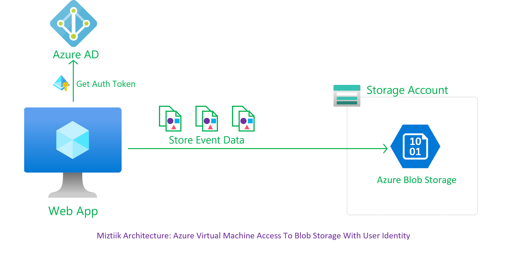
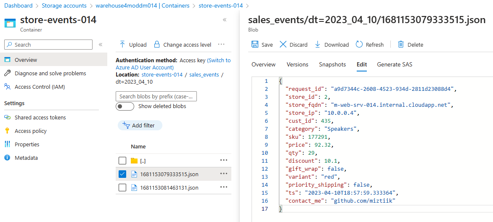

# Azure Virtual Machine Access To Blob Storage With User Identity

The developer at Mystique Unicorn are looking for a way store their order events coming from their stores across the world. They are currently using Azure Blob storage for their data lake and would like to store these events there.  A sample of the event is shown below. 

```json
{
    "request_id": "fef1127f-65df-4bca-bc58-e102fb65ee70",
    "store_id": 6,
    "store_fqdn": "m-web-srv-011.internal.cloudapp.net",
    "store_ip": "10.0.0.4",
    "cust_id": 989,
    "category": "Laptops",
    "sku": 126551,
    "price": 10.61,
    "qty": 6,
    "discount": 2.7,
    "gift_wrap": false,
    "variant": "black",
    "priority_shipping": true,
    "ts": "2023-04-10T16:25:04.411091",
    "contact_me": "github.com/miztiik"
}
```

They would like to store the data by date so that they can query them easily. For example query the sales across stores based on store id on a given date. 

Can you show them how the can get started? 

## 🎯 Solutions

To store all the order events, we will create a blob container. To write the events to the container, lets use a user managed identity with it permission scoped narrowly to a specific blob conainer using Azure RBAC.<sup>[1], [2], [3]</sup>.




1. ## 🧰 Prerequisites

   This demo, instructions, scripts and bicep template is designed to be run in `westeurope`. With few or no modifications you can try it out in other regions as well(_Not covered here_).

   - 🛠 Azure CLI Installed & Configured - [Get help here](https://learn.microsoft.com/en-us/cli/azure/install-azure-cli)
   - 🛠 Bicep Installed & Configured - [Get help here](https://learn.microsoft.com/en-us/azure/azure-resource-manager/bicep/install)
   - 🛠 VS Code & Bicep Extenstions - [Get help here](https://learn.microsoft.com/en-us/azure/azure-resource-manager/bicep/install#vs-code-and-bicep-extension)

1. ## ⚙️ Setting up the environment

   - Get the application code

     ```bash
     git clone https://github.com/miztiik/azure-vm-to-blob-storage
     cd azure-vm-to-blob-storage
     ```

1. ## 🚀 Prepare the environment

   Let check you have Azure Cli working with 

    ```bash
      # You should have azure cli preinstalled
      az account show
    ```

    You should see an output like this,

   ```json
    {
      "environmentName": "AzureCloud",
      "homeTenantId": "16b30820b6d3",
      "id": "1ac6fdbff37cd9e3",
      "isDefault": true,
      "managedByTenants": [],
      "name": "YOUR-SUBS-NAME",
      "state": "Enabled",
      "tenantId": "16b30820b6d3",
      "user": {
        "name": "miztiik@",
        "type": "user"
      }
    }
   ```

1. ## 🚀 Deploying the application

   Let us walk through each of the stacks,

   - **Stack: Main Bicep**
     The params required for the modules are in `params.json`. Do modify them to suit your need.(_Especially the `adminPassword.secureString` for the VM. You are strongly encouraged to Just-In-Time access or use SSH key instead of password based authentication_). The helper deployment script `deploy.sh` will deploy the `main.bicep` file. This will create the following resoureces
     - Resource Group(RG)
     - VNet, Subnet & Virtual Machine
     - Virtual Machine(Ubuntu)
        - (_WIP_)Bootstrapped with custom libs using `userData` script.
     - Storage Account - `warehouseXXXX`
        - Blob Container - `store-events-xxx`
     - User Managed Identity
        - Scoped with contributor privileges with conditional access restricting to a container, (_For ex `store-events-xxx`_)
      - Identity attached to the VM

     After successfully deploying the stack, Check the `Resource Groups/Deployments` section for the resources.


1. ## 🔬 Testing the solution

   - **Connect to the VM**

      The Ubuntu vm _should_ be bootstrapped using `userData` to install python3, git and also Azure Blob Storage Client Library<sup>[4]</sup>. (_For some reason the userData, bootstrap script fails, [Let me know if know how to fix it](/issues))

      - Connect to the using using Just In Time Access<sup>[5]</sup>.
      - Copy the `az_producer.py` to the server.
      - The python script expects the storage account name (`SA_NAME`) and blob container name (`CONTAINER_NAME`) as environment variables. We need to set them before execution.(_Update to your values in the below code_)

        ```bash
        ssh miztiik@publicIP
        git clone https://github.com/miztiik/azure-vm-to-blob-storage
        cd azure-vm-to-blob-storage

        # If pre-reqs have not been installed, run the bootstrap script manually
        # bash /var/azure-vm-to-blob-storage/modules/vm/bootstrap_scripts/deploy_app.sh
        export SA_NAME="warehouse4moddm014"
        export CONTAINER_NAME="store-events-014"
        python3 /var/azure-vm-to-blob-storage/app/az_producer.py
        ```

        If everything goes all right, you should see messages like this,

        ```bash
        INFO:azure.core.pipeline.policies.http_logging_policy:Request URL: 'https://warehouse4moddm014.blob.core.windows.net/store-events-014/sales_events/dt%3D2023_04_10/1681153081463131.json'
        Request method: 'PUT'
        Request headers:
            'Content-Length': '386'
            'x-ms-blob-type': 'REDACTED'
            'If-None-Match': '*'
            'x-ms-version': 'REDACTED'
            'Content-Type': 'application/octet-stream'
            'Accept': 'application/xml'
            'Last-Modified': 'Mon, 10 Apr 2023 18:58:01 GMT'
            'ETag': '"0x8DB39F5820D3CEA"'
            'Server': 'Windows-Azure-Blob/1.0 Microsoft-HTTPAPI/2.0'
            'x-ms-request-id': 'ded43899-001e-0019-62de-6bf3bd000000'
            'x-ms-client-request-id': '9dd7975a-d7d1-11ed-82ed-0bcd26fbfe68'
            'x-ms-version': 'REDACTED'
            'x-ms-content-crc64': 'REDACTED'
            'x-ms-request-server-encrypted': 'REDACTED'
            'Date': 'Mon, 10 Apr 2023 18:58:00 GMT'
        INFO:root:Blob sales_events/dt=2023_04_10/1681153081463131.json uploaded successfully
        ```

      The script should create store events and write them to Blob container. The path should be something like this `store-events-014/sales_events/dt=2023_04_10/1681153079333515.json`

      


  1. **Troubleshooting Azure Monitor Agent**

      - Check if the VM can write to blob using cli. List Blobs

        ```sh
          RG_NAME="MIZTIIK_ENTERPRISES_AZURE_VM_TO_BLOB_STORAGE_011"
          SA_NAME="warehousei5chd4011"
          CONTAINER_NAME="store-events-011"

          az storage blob list \
              --container-name ${CONTAINER_NAME1} \
              --account-name ${SA_NAME} \
              --auth-mode login

          az storage blob directory list \
              --container-name ${CONTAINER_NAME} \
              -d default \
              --account-name ${SA_NAME} \
              --auth-mode login
        ```

        Upload file to blob,

        ```sh
        echo "hello world on $(date +'%Y-%m-%d')" > miztiik.log
        az storage blob upload \
          --account-name ${SA_NAME} \
          --container-name ${CONTAINER_NAME} \
          --name miztiik.log \
          --file miztiik.log \
          --auth-mode login
        ```

      
1. ## 📒 Conclusion

    Here we have demonstrated how to store files or byte stream data to Azure Blob Containers. You can extend the solution to setup trigger in blob conatiners to further process these events.
  

1. ## 🧹 CleanUp

If you want to destroy all the resources created by the stack, Execute the below command to delete the stack, or _you can delete the stack from console as well_

- Resources created during [Deploying The Application](#-deploying-the-application)
- _Any other custom resources, you have created for this demo_

```bash
# Delete from resource group
az group delete --name Miztiik_Enterprises_xxx --yes
# Follow any on-screen prompt
```

This is not an exhaustive list, please carry out other necessary steps as maybe applicable to your needs.

## 📌 Who is using this

This repository aims to show how to Bicep to new developers, Solution Architects & Ops Engineers in Azure.

### 💡 Help/Suggestions or 🐛 Bugs

Thank you for your interest in contributing to our project. Whether it is a bug report, new feature, correction, or additional documentation or solutions, we greatly value feedback and contributions from our community. [Start here](/issues)

### 👋 Buy me a coffee

[](https://ko-fi.com/Q5Q41QDGK) Buy me a [coffee ☕][900].

### 📚 References


1. [Azure Docs: Azure Storage Queue][1]
1. [Azure Docs: Send & Receive from Queue with Python][2]
1. [Azure Docs: Azure RBAC Example Conditions][3]
1. [Azure Docs: Azure Blob Storage client library for Python][4]
1. [Azure Docs: Just In Time Access][5]
1. [Azure Docs: Python Queue Sample Code][6]
1. [Azure Docs: Python Queue Client Class][7]
1. [Azure Docs: Python Queue Message Class][8]
1. [Azure Docs: Configure pythong logging in the Azure libraries][9]


### 🏷️ Metadata


**Level**: 200

[1]: https://learn.microsoft.com/en-us/azure/storage/queues/storage-queues-introduction
[2]: https://learn.microsoft.com/en-us/azure/storage/queues/storage-python-how-to-use-queue-storage
[3]: 
[4]: 
[5]: 
[6]: https://github.com/Azure/azure-sdk-for-python/tree/azure-storage-queue_12.6.0/sdk/storage/azure-storage-queue/samples
[7]: https://learn.microsoft.com/en-us/python/api/azure-storage-queue/azure.storage.queue.queueclient?view=azure-python#azure-storage-queue-queueclient-send-message
[8]: https://learn.microsoft.com/en-us/python/api/azure-storage-queue/azure.storage.queue.queuemessage?view=azure-python
[9]: https://learn.microsoft.com/en-us/azure/developer/python/sdk/azure-sdk-logging

[100]: https://www.udemy.com/course/aws-cloud-security/?referralCode=B7F1B6C78B45ADAF77A9
[101]: https://www.udemy.com/course/aws-cloud-security-proactive-way/?referralCode=71DC542AD4481309A441
[102]: https://www.udemy.com/course/aws-cloud-development-kit-from-beginner-to-professional/?referralCode=E15D7FB64E417C547579
[103]: https://www.udemy.com/course/aws-cloudformation-basics?referralCode=93AD3B1530BC871093D6
[899]: https://www.udemy.com/user/n-kumar/
[900]: https://ko-fi.com/miztiik
[901]: https://ko-fi.com/Q5Q41QDGK